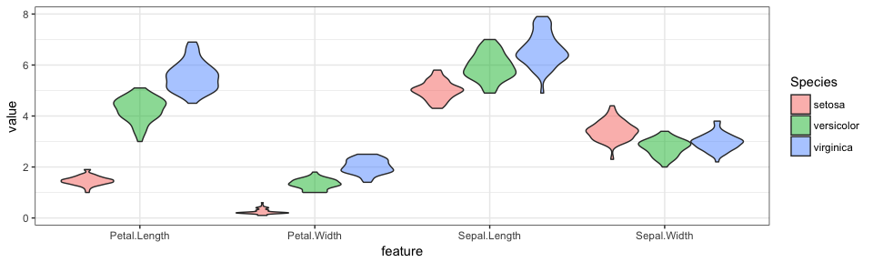
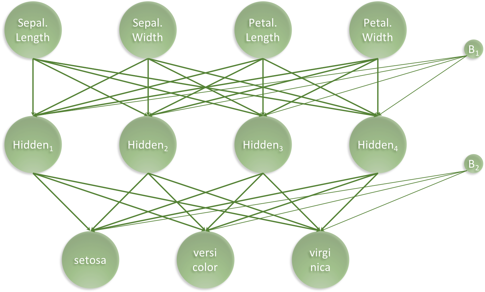
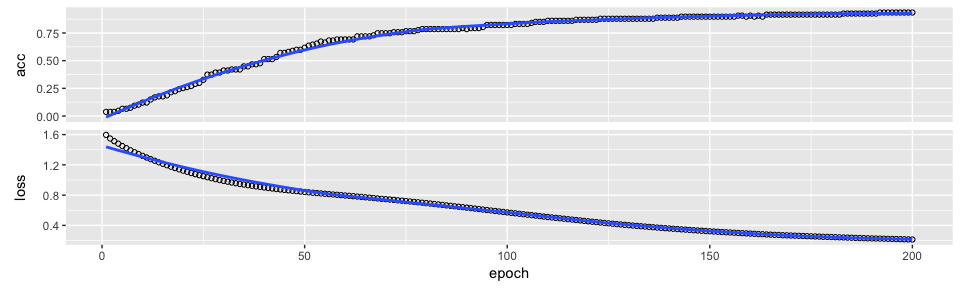
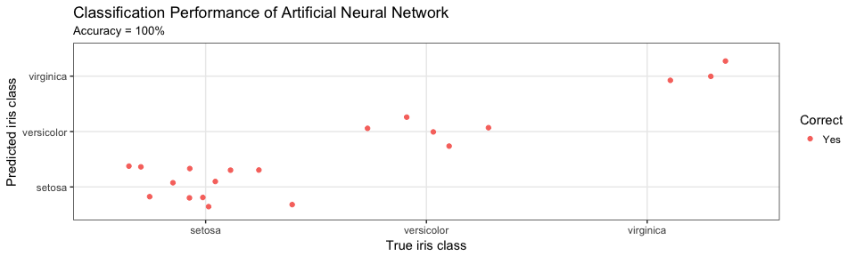

Building a simple neural network using Keras and Tensorflow
================

A minimal example for building your first simple artificial neural network using [Keras and TensorFlow for R](https://tensorflow.rstudio.com/keras/) - Right, let's get to it!

### Data

[The famous Iris flower data set](https://en.wikipedia.org/wiki/Iris_flower_data_set) contains data to quantify the morphologic variation of Iris flowers of three related species. In other words - A total of 150 observations of 4 input features `Sepal.Length`, `Sepal.Width`, `Petal.Length` and `Petal.Width` and 3 output classes `setosa` `versicolor` and `virginica`, with 50 observations in each class. The distributions of the feature values looks like so:

``` r
iris %>% as_tibble %>% gather(feature, value, -Species) %>%
  ggplot(aes(x = feature, y = value, fill = Species)) +
  geom_violin(alpha = 0.5, scale = "width", position = position_dodge(width = 0.9)) +
  geom_boxplot(alpha = 0.5, width = 0.2, position = position_dodge(width = 0.9)) +
  theme_bw()
```



### Aim

Our aim is to connect the 4 input features (`Sepal.Length`, `Sepal.Width`, `Petal.Length` and `Petal.Width`) to the correct output class (`setosa` `versicolor` and `virginica`) using an artificial neural network. For this task, we have chosen the following simple architecture with one input layer with 4 neurons (one for each feature), one hidden layer with 4 neurons and one output layer with 3 neurons (one for each class), all fully connected:



Our artificial neural network will have a total of 35 parameters: 4 for each input neuron connected to the hidden layer, plus an additional 4 for the associated first bias neuron and 3 for each of the hidden neurons connected to the output layer, plus an additional 3 for the associated second bias neuron. I.e. 4 ⋅ 4 + 4 + 4 ⋅ 3 + 3 = 35

### Install Keras and TensorFlow for R

Before we begin, we need to install [Keras and TensorFlow for R](https://tensorflow.rstudio.com/keras/) as follows:

``` r
install.packages("keras")
```

TensorFlow is the default backend engine. TensorFlow and Keras can be installed as follows:

``` r
library(keras)
install_keras()
```

We also need to install [`TidyVerse`](https://www.tidyverse.org/):

``` r
install.packages("tidyverse")
```

### Load libraries

``` r
library("keras")
library("tidyverse")
```

### Prepare data

We start with slightly wrangling the iris data set by renaming and scaling the features and converting character labels to numeric:

``` r
nn_dat = iris %>% as_tibble %>%
  mutate(sepal_l_feat = scale(Sepal.Length),
         sepal_w_feat = scale(Sepal.Width),
         petal_l_feat = scale(Petal.Length),
         petal_w_feat = scale(Petal.Width),          
         class_num    = as.numeric(Species) - 1, # factor, so = 0, 1, 2
         class_label  = Species) %>%
  select(contains("feat"), class_num, class_label)
nn_dat %>% head(3)
```

    ## # A tibble: 3 x 6
    ##   sepal_l_feat sepal_w_feat petal_l_feat petal_w_feat class_num
    ##          <dbl>        <dbl>        <dbl>        <dbl>     <dbl>
    ## 1       -0.898        1.02         -1.34        -1.31        0.
    ## 2       -1.14        -0.132        -1.34        -1.31        0.
    ## 3       -1.38         0.327        -1.39        -1.31        0.
    ## # ... with 1 more variable: class_label <fct>

Then, we split the iris data into a training and a test data set, setting aside 20% of the data for left out data partition, to be used for final performance evaluation:

``` r
test_f = 0.20
nn_dat = nn_dat %>%
  mutate(partition = sample(c('train','test'), nrow(.), replace = TRUE, prob = c(1 - test_f, test_f)))
```

Based on the partition, we can now create training and test data

``` r
x_train = nn_dat %>% filter(partition == 'train') %>% select(contains("feat")) %>% as.matrix
y_train = nn_dat %>% filter(partition == 'train') %>% pull(class_num) %>% to_categorical(3)
x_test  = nn_dat %>% filter(partition == 'test')  %>% select(contains("feat")) %>% as.matrix
y_test  = nn_dat %>% filter(partition == 'test')  %>% pull(class_num) %>% to_categorical(3)
```

### Set Architecture

With the data in place, we now set the architecture of our artificical neural network:

``` r
model = keras_model_sequential()
model %>% 
  layer_dense(units = 4, activation = 'relu', input_shape = 4) %>% 
  layer_dense(units = 3, activation = 'softmax')
model %>% summary
```

    ## ___________________________________________________________________________
    ## Layer (type)                     Output Shape                  Param #     
    ## ===========================================================================
    ## dense_1 (Dense)                  (None, 4)                     20          
    ## ___________________________________________________________________________
    ## dense_2 (Dense)                  (None, 3)                     15          
    ## ===========================================================================
    ## Total params: 35
    ## Trainable params: 35
    ## Non-trainable params: 0
    ## ___________________________________________________________________________

As expected we see 35 trainable parameters. Next, the architecture set in the model needs to be compiled:

``` r
model %>% compile(
  loss      = 'categorical_crossentropy',
  optimizer = optimizer_rmsprop(),
  metrics   = c('accuracy')
)
```

### Train the Artificial Neural Network

Lastly we fit the model and save the training progres in the `history` object:

``` r
history = model %>% fit(
  x = x_train, y = y_train,
  epochs           = 200,
  batch_size       = 20,
  validation_split = 0
)
plot(history)
```



### Evaluate Network Performance

The final performance can be obtained like so:

``` r
perf = model %>% evaluate(x_test, y_test)
print(perf)
```

    ## $loss
    ## [1] 0.3843208
    ## 
    ## $acc
    ## [1] 1

Then we can augment the `nn_dat` for plotting:

``` r
plot_dat = nn_dat %>% filter(partition == 'test') %>%
  mutate(class_num = factor(class_num),
         y_pred    = factor(predict_classes(model, x_test)),
         Correct   = factor(ifelse(class_num == y_pred, "Yes", "No")))
plot_dat %>% select(-contains("feat")) %>% head(3)
```

    ## # A tibble: 3 x 5
    ##   class_num class_label partition y_pred Correct
    ##   <fct>     <fct>       <chr>     <fct>  <fct>  
    ## 1 0         setosa      test      0      Yes    
    ## 2 0         setosa      test      0      Yes    
    ## 3 0         setosa      test      0      Yes

and lastly, we can visualise the confusion matrix like so:

``` r
title     = "Classification Performance of Artificial Neural Network"
sub_title = str_c("Accuracy = ", round(perf$acc, 3) * 100, "%")
x_lab     = "True iris class"
y_lab     = "Predicted iris class"
plot_dat %>% ggplot(aes(x = class_num, y = y_pred, colour = Correct)) +
  geom_jitter() +
  scale_x_discrete(labels = levels(nn_dat$class_label)) +
  scale_y_discrete(labels = levels(nn_dat$class_label)) +
  theme_bw() +
  labs(title = title, subtitle = sub_title, x = x_lab, y = y_lab)
```



### Conclusion

Here, we created a 3-class predictor with an accuracy of 100% on a left out data partition. I hope this little post illustrated how you can get started building artificial neural network using [Keras and TensorFlow in R](https://keras.rstudio.com/). This was a basic minimal example. It should be noted that the network can be expanded to create full deep Learning networks and furhtermore, the entire TensorFlow API is available. It also goes to show how important it is for a data scientist, that the tools needed to go effeciently from idea to implementation is available - Available and accessible technology is the cornerstone of modern data science.

Enjoy and Happy Learning!

Leon
